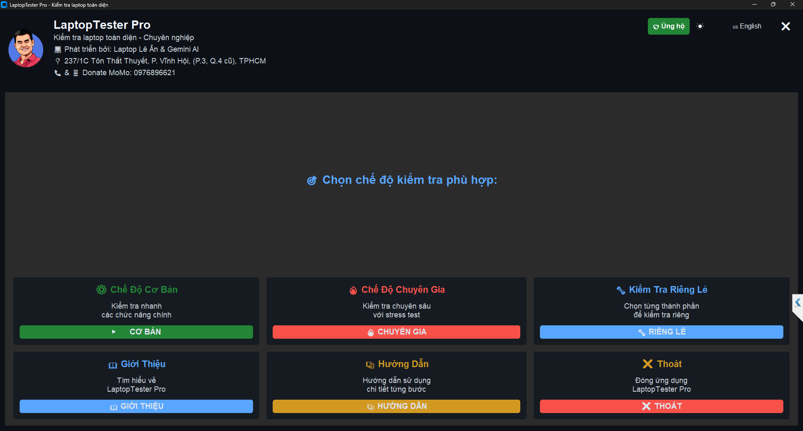
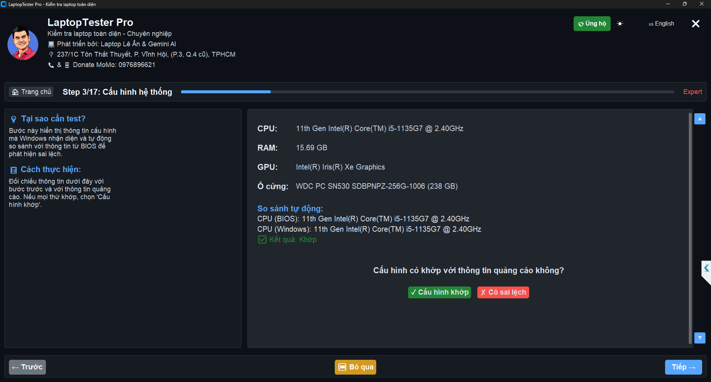

# LaptopTester Pro - Phiên Bản Portable

##  TÍNH NĂNG ĐẶC BIỆT

###  CHỐNG GIẢ MẠO CẤU HÌNH - ĐỘC QUYỀN

- **Phát Hiện 100% Phần Mềm Giả Mạo**
- **Kiểm Tra Chéo Với CSDL Toàn Cầu**
- **Bóc Trần Thông Số Thực/Ảo**
- **Báo Cáo Chi Tiết Từng Linh Kiện**
- **Cảnh Báo Máy Đã Qua Sửa Chữa**

###  TEST PHÍM THÔNG MINH - KHÔNG CẦN FN

- **Tự Động Nhận Diện Phím Chức Năng**
- **Không Cần Nhấn Nút FN**
- **Test Được Cả Khi Phím FN Bị Hỏng**
- **Hiển Thị Trực Quan Từng Phím**
- **Phát Hiện Phím Bị Kẹt/Lỗi**

### 🎥 BẢO MẬT CAMERA - CÔNG NGHỆ MỚI

- **Phát Hiện Vật Cản/Che Camera**
- **Cảnh Báo Rủi Ro An Ninh**
- **Kiểm Tra Webcam Bị Can Thiệp**
- **Đề Xuất Giải Pháp Bảo Vệ**
- **Theo Dõi Trạng Thái Realtime**

## 🤝 CHƯƠNG TRÌNH AFFILIATE

### Hỗ Trợ Phát Triển
- **MIỄN PHÍ 100% Tính Năng Cơ Bản**
- **Hiển Thị Đề Xuất Sản Phẩm Chất Lượng**
- **Doanh Thu Giúp Duy Trì & Phát Triển**
- **Người Dùng Được Giá Ưu Đãi**
- **Hoàn Toàn Minh Bạch & Tự Nguyện**

### Quyền Lợi Người Dùng
- **Giảm Giá Đặc Biệt Từ Đối Tác**
- **Sản Phẩm Chất Lượng Đã Kiểm Chứng**
- **Hỗ Trợ Kỹ Thuật Ưu Tiên**
- **Có Thể Tắt Trong Cài Đặt**

##  Yêu Cầu Hệ Thống
- Windows 10/11
- 4GB RAM trở lên
- Quyền Administrator
- .NET Framework 4.7.2

##  Hỗ Trợ 24/7
- Email: anlvdt@gmail.com
- GitHub Issues
- Discord Community
