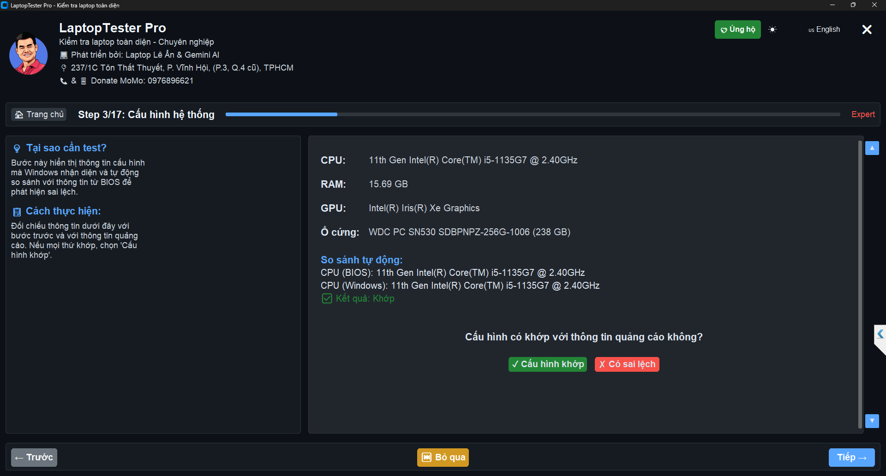
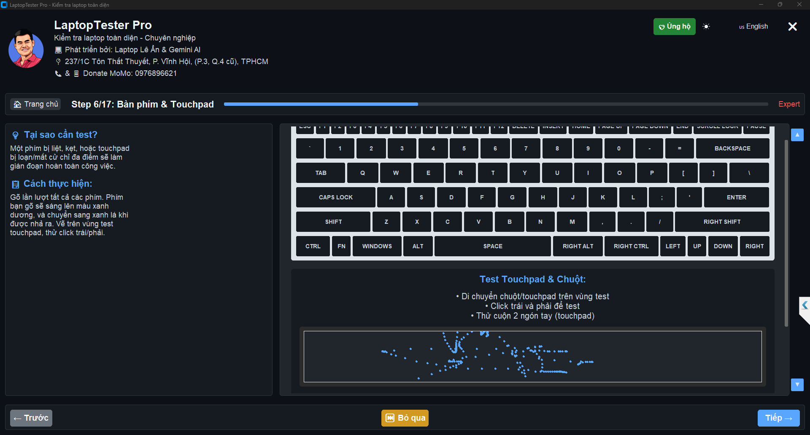
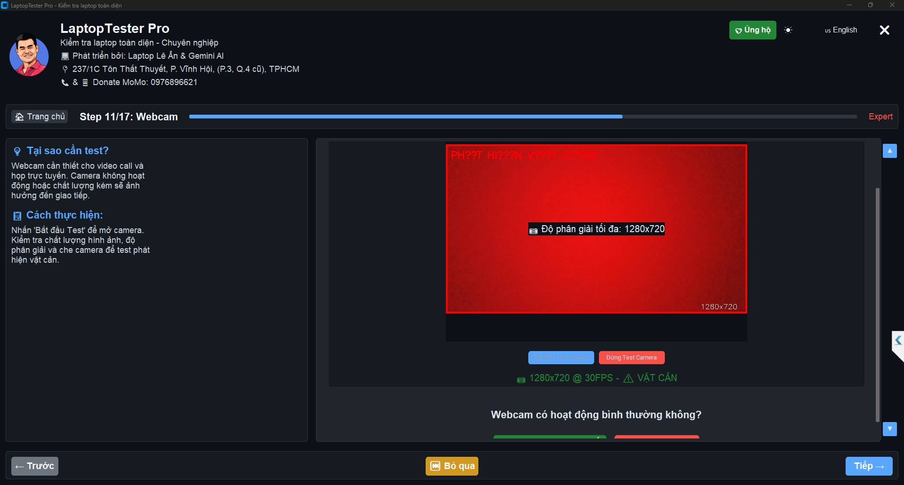

# LaptopTester Pro - Portable Version

##  SPECIAL FEATURES

###  ANTI-FAKE CONFIGURATION - EXCLUSIVE

- **Detect 100% Fake Hardware Information**
- **Cross-check with Global Hardware Database**
- **Reveal Real vs Virtual Specifications**
- **Detailed Component Reports**
- **Modified Hardware Alerts**

###  SMART KEYBOARD TEST - NO FN REQUIRED

- **Auto Function Key Detection**
- **No FN Key Required**
- **Works Even with Broken FN Key**
- **Visual Key Status Display**
- **Stuck/Faulty Key Detection**

###  CAMERA SHIELD - NEW TECHNOLOGY

- **Detect Camera Cover/Obstacle**
- **Security Risk Alerts**
- **Webcam Tampering Check**
- **Protection Solutions**
- **Realtime Status Monitoring**

##  AFFILIATE PROGRAM

### Development Support
- **100% FREE Basic Features**
- **Quality Product Recommendations**
- **Revenue Helps Maintain & Develop**
- **Special Discounts for Users**
- **Completely Transparent & Optional**

### User Benefits
- **Special Partner Discounts**
- **Verified Quality Products**
- **Priority Technical Support**
- **Can Be Disabled in Settings**

##  System Requirements
- Windows 10/11
- 4GB RAM minimum
- Administrator Rights
- .NET Framework 4.7.2

##  24/7 Support
- Email: anlvdt@gmail.com
- GitHub Issues
- Discord Community
